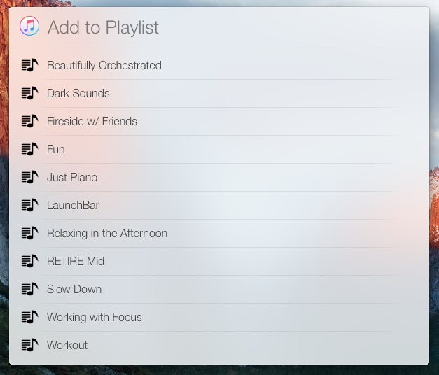

# Add to Playlist
*...with suggestions*

Quickly add the currently playing track to any user created playlist in iTunes. The suggestions will filter as you type.

Link to a code signed copy of the action can be found [here](http://bradyrosino.com/2015/09/12/adding-songs-to-playlists-with-launchbar/).

### Future Improvements
- Display a subtitle on playlist suggestion if the track is already on that playlist
- Display an error/confirmation dialog if duplicating a song on a playlist
